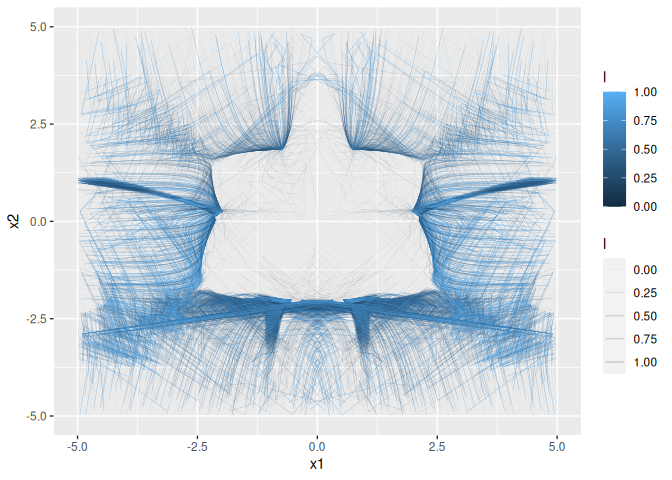

<!-- README.md is generated from README.Rmd. Please edit that file -->

# w4

<!-- badges: start -->

[](https://CRAN.R-project.org/package=w4)
[](https://lifecycle.r-lib.org/articles/stages.html#experimental)
<!-- badges: end -->

`{w4}` provides the [W4
method](https://doi.org/10.1016/j.apnum.2022.08.019) for nonlinear root
finding.

Relative to the NR method, the W4 method provides a wider convergence
region (Newton basin) at the cost of converging only linearly (the NR
method converges quadratically).

## Installation

You can install the development version of `{w4}` from
[GitHub](https://github.com/) with:

``` r
# install.packages("remotes")
remotes::install_github("ramiromagno/w4")
```

## Basic usage

``` r
library(w4)

func <- function(x) {
  c(x[1] ^ 2 + x[2] ^ 2 - 4, x[1] ^ 2 * x[2] - 1)
}

func_abs <- function(x) {
  c(abs(x[1] ^ 2) + abs(x[2] ^ 2) + abs(-4),
    abs(x[1] ^ 2 * x[2]) + abs(-1))
}

jac <- function(x) {
  matrix(c(2 * x[1], 2 * x[2],
           2 * x[1] * x[2], x[1] ^ 2),
         nrow = 2L,
         byrow = TRUE)
}

# By default w4 uses SV decomposition, equivalent to `decomposition = "sv"`
w4(x0 = c(-5, 0.5), func = func, Fa = func_abs, jacfunc = jac)
#> # A tibble: 1 × 4
#>       i     error    x1    x2
#>   <dbl>     <dbl> <dbl> <dbl>
#> 1    30 0.0000775 -1.98 0.254

# LH decomposition
w4(x0 = c(-5, 0.5), func = func, Fa = func_abs, jacfunc = jac, decomposition = "lh")
#> # A tibble: 1 × 4
#>       i     error    x1    x2
#>   <dbl>     <dbl> <dbl> <dbl>
#> 1    27 0.0000699 -1.98 0.254

# LU decomposition
w4(x0 = c(-5, 0.5), func = func, Fa = func_abs, jacfunc = jac, decomposition = "lu")
#> # A tibble: 1 × 4
#>       i     error    x1    x2
#>   <dbl>     <dbl> <dbl> <dbl>
#> 1    24 0.0000765 -1.98 0.254
```

## A different starting point

``` r
w4(x0 = c(1, -2.0), func = func, Fa = func_abs, jacfunc = jac, decomposition = "sv")
#> # A tibble: 1 × 4
#>       i     error    x1    x2
#>   <dbl>     <dbl> <dbl> <dbl>
#> 1   187 0.0000625 -1.98 0.254
w4(x0 = c(1, -2.0), func = func, Fa = func_abs, jacfunc = jac, decomposition = "lh")
#> # A tibble: 1 × 4
#>       i     error    x1    x2
#>   <dbl>     <dbl> <dbl> <dbl>
#> 1   136 0.0000898  1.98 0.254
w4(x0 = c(1, -2.0), func = func, Fa = func_abs, jacfunc = jac, decomposition = "lu")
#> # A tibble: 1 × 4
#>       i     error    x1    x2
#>   <dbl>     <dbl> <dbl> <dbl>
#> 1   303 0.0000830  1.98 0.254
```

## Solving trace

``` r
# Solution with trace
range <- seq(-5, 5, 0.25)
x0 <- t(as.matrix(expand.grid(x1 = range, x2 = range)))
(sol_trace <- w4(x0 = x0, func = func, Fa = func_abs, jacfunc = jac, trace = TRUE))
#> # A tibble: 290,613 × 5
#>    trace_id     i error    x1    x2
#>       <int> <dbl> <dbl> <dbl> <dbl>
#>  1        1     1     1 -5    -5   
#>  2        1     2     1 -4.89 -3.96
#>  3        1     3     1 -4.86 -2.91
#>  4        1     4     1 -3.53 -3.70
#>  5        1     5     1 -3.55 -2.61
#>  6        1     6     1 -3.45 -2.01
#>  7        1     7     1 -2.13 -3.03
#>  8        1     8     1 -1.91 -2.69
#>  9        1     9     1 -1.72 -2.42
#> 10        1    10     1 -1.53 -2.24
#> # … with 290,603 more rows

# pivot_longer(cols = starts_with("x"), names_to = "var", values_to = "x") %>%
sol_trace %>%
  group_by(trace_id) %>%
  mutate(l = (i - 1) / (max(i) -1)) %>%
  ggplot(aes(x = x1, y = x2, colour = l, alpha = l, group = trace_id)) +
  geom_path(linewidth = 0.1) +
  lims(x = c(-5, 5), y = c(-5, 5))
#> Warning: Removed 67571 rows containing missing values (`geom_path()`).
```


